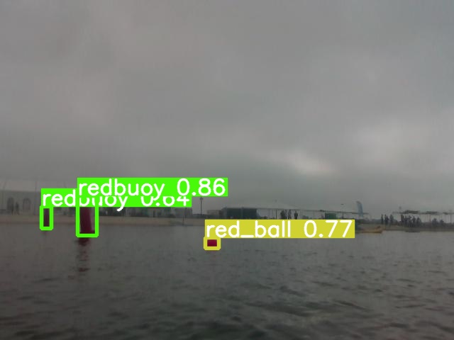

# YOLOv9 Fine-Tuning Guide for Object Detection

This repository provides a structured approach to fine-tuning the YOLOv9 model for custom object detection tasks. The included notebook and modular project structure aim to simplify the process for both beginners and advanced users.

---

## Features

- **Step-by-Step Notebook**: A complete guide to fine-tuning YOLOv9 using pre-trained weights and a custom dataset.
- **Dataset Preparation**: Tools to combine and process training and validation datasets dynamically.
- **Training and Validation**: Scripts and configurations to train and validate your YOLOv9 model effectively.
- **Inference**: Run inference on test images to evaluate the model’s performance visually.
- **Customizable Configurations**: Example `data.yaml` and model architecture files to get started quickly.

---

## Example Results

Below is an example of the model's inference results on the test dataset:

---

## Acknowledgments

We extend our gratitude to the following resources and contributors for their foundational work and assets:

1. **YOLOv9 Model Repository**: [WongKinYiu/yolov9](https://github.com/WongKinYiu/yolov9)  
   For providing the YOLOv9 model and pre-trained weights.

2. **Training Notebook Inspiration**: [SkalskiP/yolov9](https://github.com/SkalskiP/yolov9.git)  
   For their notebook that inspired this guide.

3. **Dataset**: [Roboflow - El Señor de la Noche](https://universe.roboflow.com/pedro-pagan/el-senor-de-la-noche/dataset/2)  
   The dataset used in this project is licensed under CC BY 4.0.

---

## Getting Started

### Download the Notebook

To get started with fine-tuning YOLOv9, download the notebook provided in this repository. The notebook contains all the necessary steps to:

- Clone the YOLOv9 repository.
- Prepare the dataset.
- Fine-tune the YOLOv9 model.
- Perform validation and inference.

#### Steps to Get Started:

1. **Download the Notebook**  
   [Click here to download `fine_tuning_yolov9.ipynb`](https://github.com/DevDizzle/YOLOv9-Object-Detection-Guide/blob/main/fine_tuning_yolov9.ipynb).

2. **Upload the Notebook to Google Colab**  
   - Open [Google Colab](https://colab.research.google.com/).
   - Click on **File > Upload Notebook** and select the downloaded notebook.

3. **Run the Notebook**  
   Follow the step-by-step instructions in the notebook to:
   - Clone the YOLOv9 repository.
   - Prepare and configure your dataset.
   - Fine-tune the YOLOv9 model.
   - Validate the model and perform inference on test images.
